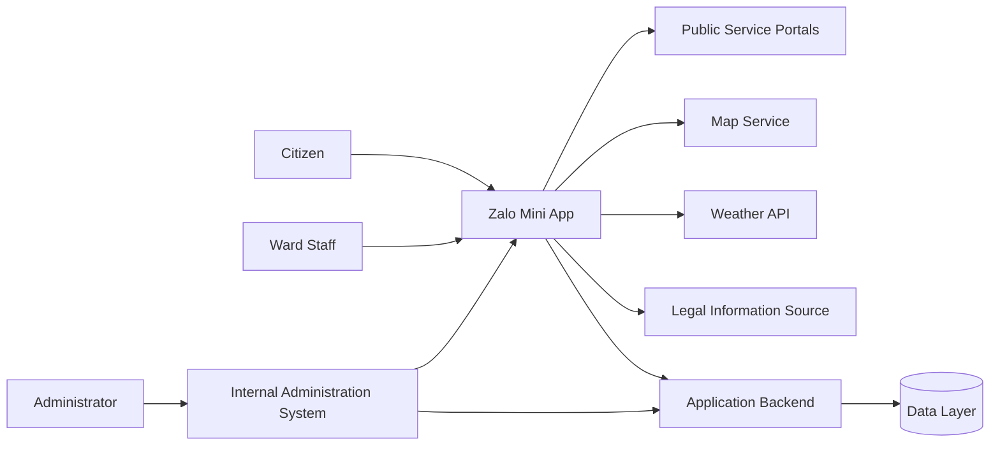

# Zalo Mini App phường Láng

> **Business Analysis & Project Management Portfolio**  
> Digital Government · Public Services · Zalo Mini App

## 📌 Project Overview

**Zalo Mini App phường Láng** is a digital government solution designed to support public-service information delivery and interaction between **UBND phường Láng** and local citizens through the Zalo platform.

The solution provides citizens with a centralized mobile access point for official ward information, administrative procedure guidance, local-area information, maps, citizen feedback, digital utilities, and AI-assisted information retrieval — without requiring users to install a separate mobile application.

The overall solution consists of:

- **Zalo Mini App** for citizens and authorized ward staff
- **Internal administration system** for managing content and data
- External integrations such as maps, weather services, legal-information sources, and public-service portals

### Project Information

| Item | Description |
|---|---|
| Project | Zalo Mini App phường Láng |
| Domain | Digital Government / Public Administration |
| Client / Business Owner | UBND phường Láng |
| Solution Provider | MobiFone |
| Implementation | ConnectedBrain |
| Web Development | SSIT |
| Platform | Zalo Mini App |
| My Role | **Project Manager / Business Analyst** |
| Status | **Deployed / Portfolio documentation updated after implementation** |

---

## 🎯 Business Problem

Before the solution was introduced, citizens could need to search across multiple information channels or contact the ward directly just to obtain basic administrative guidance.

The main business pain points identified were:

- Public information distributed across different channels
- Difficulty identifying the correct administrative procedure or service channel
- Time spent calling or visiting the ward for initial guidance
- Lack of a convenient and private citizen-feedback channel
- Local-area data requiring centralized management and updating
- Internal information requiring controlled access

The project therefore aimed to establish a **single digital access point within Zalo** that could simplify access to ward-level information and services.

---

## 💡 Proposed Solution

The To-Be solution centralizes ward information and citizen-facing utilities inside a Zalo Mini App.

The platform is designed to:

- Provide official and up-to-date ward information
- Help citizens look up administrative procedures
- Guide users to the appropriate public-service portal or specialized system
- Provide local-area and residential-group information
- Display public locations on a digital map
- Allow citizens to submit feedback with images
- Keep citizen feedback private
- Provide AI-assisted legal and administrative Q&A
- Display weather information through external APIs
- Support links to public digital services
- Allow authorized staff to access internal information
- Allow administrators to maintain approved content and data

The Mini App complements existing government service systems rather than replacing the National Public Service Portal or specialized government platforms.

---

## 👥 User Groups

### Citizen
Primary user of the Mini App, with needs including administrative procedure lookup, local-area information, maps, citizen feedback, and AI-assisted information retrieval.

### Ward Staff
Authorized users who may access selected internal information, provide and verify business data, process citizen feedback within assigned authority, and participate in testing/UAT.

### System Administrator
Administrators maintain approved Mini App content and data, including news, announcements, local-area data, map locations, staff information, and Mini App configuration.

> Detailed administration workflows and permission matrices are intentionally excluded from this public portfolio.

---

## ⭐ Key Functional Areas

1. **Ward Information Portal**
   - News and announcements
   - Ward information
   - Office address, working hours and contacts
   - Emergency contacts
   - Digital-service links

2. **Administrative Procedure Lookup**
   - Procedure information
   - Required documents
   - Relevant authority/service channel
   - Guidance and links to appropriate public-service systems

3. **Local Area Information**
   - Residential groups
   - Population and household statistics
   - Ward-level information
   - Responsible ward staff

4. **Digital Map & Navigation**
   - Public locations
   - Ward offices and useful places
   - Navigation through the device's default map application

5. **Citizen Feedback**
   - Submit feedback
   - Attach images
   - Track personal feedback
   - View responses from authorized ward staff

6. **AI Assistant**
   - Legal-information lookup
   - Common administrative information
   - Initial guidance before contacting the responsible authority

7. **Weather Integration**
   - Display weather information through an external API

8. **Internal Ward Information**
   - Selected internal content available only to authorized ward staff

9. **Seasonal / Approved Modules**
   - Features such as election/voter information may be enabled according to approved business requirements

---

## 🧩 Use Case Catalogue

| ID | Use Case | Primary Actor |
|---|---|---|
| UC-001 | Access Mini App & Public Information | Citizen |
| UC-002 | Look Up Administrative Procedures | Citizen |
| UC-003 | Navigate to Public Service / Specialized Systems | Citizen |
| UC-004 | Look Up Local Area / Residential Group Information | Citizen |
| UC-005 | View Map & Navigate | Citizen |
| UC-006 | Submit Citizen Feedback | Citizen |
| UC-007 | View Response to Personal Feedback | Citizen |
| UC-008 | Ask the AI Assistant | Citizen |
| UC-009 | View Weather Information | Citizen |
| UC-010 | Access Internal Operational Announcements | Ward Staff |
| UC-011 | Receive & Respond to Citizen Feedback | Ward Staff |
| UC-012 | Manage News & Announcements | Administrator |
| UC-013 | Manage Local Area Data & Locations | Administrator |
| UC-014 | Manage Staff / Organization & Mini App Content | Administrator |

---

## 🧑‍💼 My Role — Project Manager / Business Analyst

The portfolio demonstrates work across the requirement lifecycle, including:

- Business context and problem analysis
- Project scope definition
- Stakeholder identification and mapping
- Power / Interest analysis
- Stakeholder communication planning
- As-Is / To-Be process modeling
- User persona definition
- User journey analysis
- Business requirement specification
- Functional requirement specification
- Business rule definition
- Use Case modeling
- User Story & Acceptance Criteria definition
- Requirement traceability
- Data requirement analysis
- Integration requirement analysis
- High-level access-control and privacy analysis
- Open Issue / TBD management
- Change-impact analysis
- Support for testing, UAT and acceptance activities

---

## 📚 BA Documentation

| No. | Document | Purpose |
|---|---|---|
| `01` | **Project Overview** | Project background, objectives, stakeholders and overall baseline |
| `02` | **Project Scope** | In-scope / out-of-scope definition, constraints and deliverables |
| `03` | **Stakeholder Map** | Stakeholder analysis, influence, RACI and engagement |
| `04` | **As-Is / To-Be Process** | Current-state and target-state process analysis |
| `05` | **User Persona & User Journey** | User groups, goals, pain points and journeys |
| `06` | **Business Requirements Document (BRD)** | Business problems, objectives, requirements and rules |
| `07` | **SRS / Functional Specification** | Functional, data, integration and non-functional requirements |
| `08` | **Use Case & User Story** | Detailed Use Cases, User Stories and Acceptance Criteria |
| `09` | **MySQL Database Schema** | Portfolio-level relational schema derived from documented requirements |

---

## 🔗 Requirement Traceability

```text
Business Problems
      ↓
Business Objectives
      ↓
Business Requirements
      ↓
Functional Requirements
      ↓
Business Rules
      ↓
Use Cases / User Stories
      ↓
Acceptance Criteria
      ↓
Testing / UAT
```

---

## 🏗️ High-Level System Context



> This diagram is intentionally high-level and does not represent confidential production architecture.

---

## 📂 Repository Structure

```text
zalo-mini-app-lang/
│
├── README.md
├── 01_Project_Overview.pdf
├── 02_Project_Scope.pdf
├── 03_Stakeholder_Map.pdf
├── 04_AsIs_ToBe_Process.pdf
├── 05_User_Persona_Journey.pdf
├── 06_BRD.pdf
├── 07_SRS_Functional_Specification_Zalo_Mini_App_Phuong_Lang.pdf
├── 08_Use_Case_User_Story.pdf
└── 09_Database_Schema.sql
```

---

## 🔐 Portfolio & Confidentiality Notice

This repository is a **Business Analysis / Project Management portfolio**.

To protect project and stakeholder information:

- Personal contact information is omitted.
- Detailed internal administration screens are not disclosed.
- Detailed permission matrices are not disclosed.
- Internal operational workflows are not disclosed.
- Commercial and contractual information is excluded.
- Sensitive or non-public operational data is excluded.
- Some implementation details are intentionally represented only at a high level.
- TBD items remain explicitly marked where the available project baseline does not provide sufficient information.

The documents demonstrate the **analysis methodology, requirement structure and project understanding** without attempting to reproduce confidential production materials.

---

## 📌 Project Status

The solution has been **implemented and put into use**.

The documents in this repository are maintained as a post-implementation portfolio baseline to demonstrate the Business Analysis and Project Management work associated with the project.

---

## 👤 Author

**Lê Nguyên Phương Linh**  
Project Manager / Business Analyst

`Business Analysis` · `Requirement Engineering` · `Project Management` · `Stakeholder Management` · `Process Modeling` · `Use Case Modeling` · `User Story` · `SRS` · `BRD` · `UAT` · `Data Modeling` · `MySQL` · `Digital Government`

---

*This repository is intended for professional portfolio and learning/reference purposes.*
